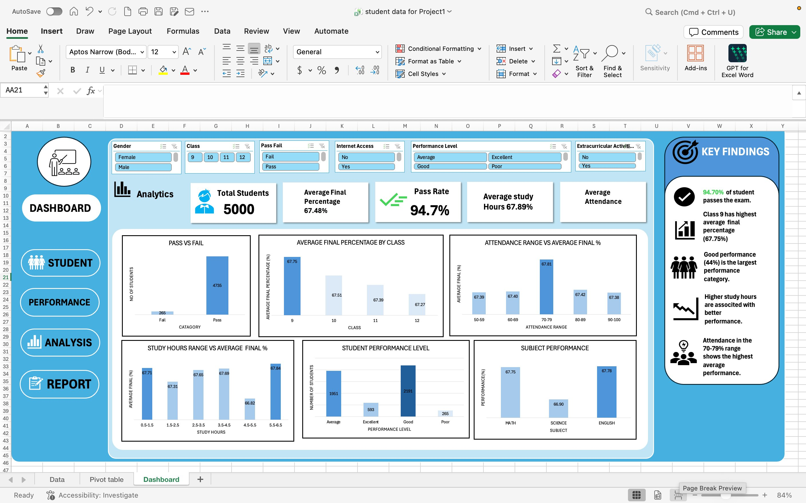

# Student Performance Analysis

## 📌 Project Overview
This project analyzes student academic performance using Microsoft Excel and SQL.

## 🎯 Objectives
- Analyze overall student performance
- Compare performance across different classes and genders
- Analyze the relationship between study hours and final percentage
- Examine attendance and academic performance
- Analyze the impact of parental education and internet access
- Identify high-performing students

## 🛠️ Tools & Technologies
- Microsoft Excel
- SQL
- Pivot Tables
- Data Analysis
- Data Visualization
- Dashboard Development

## 📊 Dataset
The dataset contains student information including:
- Student ID
- Age
- Gender
- Class
- Study Hours per Day
- Attendance Percentage
- Parental Education
- Internet Access
- Math, Science and English Scores
- Previous Year Score
- Final Percentage
- Performance Level
- Pass/Fail

## 📈 Analysis
The project analyzes student performance based on study hours, attendance, gender, class, parental education and internet access.

## 🖼️ Dashboard

## 📁 Project Files
- Excel dataset and analysis
- SQL analysis
- PowerPoint presentation
- Dashboard screenshot

## 💡 Key Skills Demonstrated
- Data Cleaning
- Data Analysis
- Excel Dashboard Creation
- SQL Querying
- Data Visualization
- Insight Generation
- ## 🖼️ Dashboard Preview

